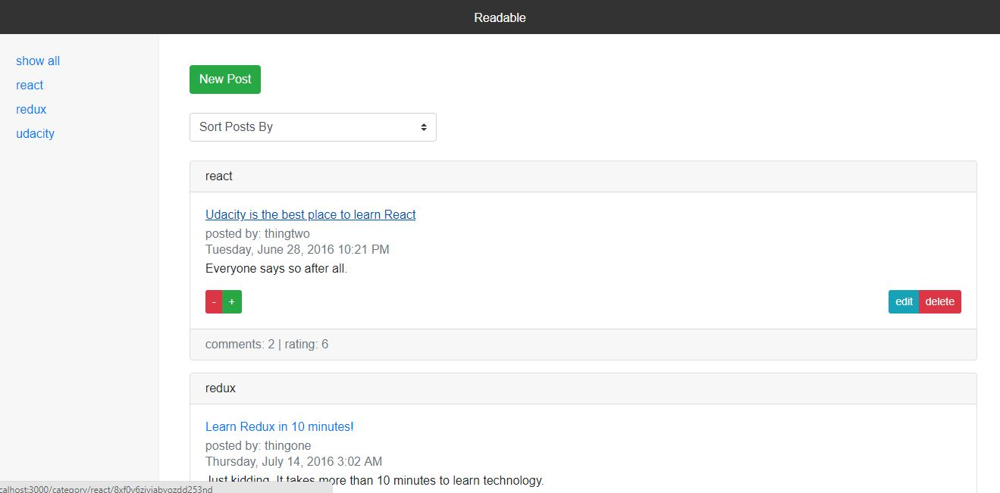

# **Readable**

##### A project built with React and Redux
#
##### By [Sam Peppard](https://github.com/sampeppard)
#


----
### **Description**

A project that allows a user to views posts on various topics and comment on them. The user can also create posts. This is a SPA created with React and Redux.

This is project created for Udacity's Redux Nanodegree course.

This project was created based on provided starter for a backend server.

----
### **Specifications**
| _Behavior_ | _Input_ | _Output_ |
|:---------------------------------------------------------------------:|:---------------------------------------------------------------------------:|:-------------------------------------------------------------------------------------------------------------------:|
| Enter a post | New post: Best way to build a redux app | Result: "i'm looking for the best way to make a CRUD app, any suggestions?" |
| Enter post's author | Posts's author: Bob Sherman | Result: author: Bob Sherman |
| Enter post body | Post body: "the app is a CRUD app nice an simple, nothing fancy!" | Result: body: "the app is a CRUD app nice an simple, nothing fancy!" |
| Enter post category| Post category: "redux" | Result: category: "redux" |
| View logged posts | Select question/topic | edit a question/topic's content, author or details |
| Enter a post comment | Comment title: "use redux with react router!" Comment author: "Cal Clutterbuck"  | Result: title: "use redux with react router!" author: "Cal Clutterbuck" |

----
### **Setup/Installation Requirements**

If editing or running locally:

##### 1. First, make sure the following is installed on your machine

##### 2. make sure you have npm installed - check link below for installation

https://nodejs.org/en/download/

###### then

#### Clone this repository: https://github.com/sampeppard/book-shelves.git

```git clone https://github.com/sampeppard/book-shelves.git```

#### OPEN project folder ('book-shelves') in Code Editor of choice

* Run following commands from command line
* ```cd api-server```
* ```npm install``` or ```yarn install```
* ```node server``` to start backend server

Open another terminal at the root of the project

* ```cd frontend```
* ```npm install``` or ```yarn install```
* ```npm start``` or ```yarn start``` to start the development server

----

### **Known Bugs**

No known bugs.

----
### **Support and contact details**

For comments or questions, please email sampeppard@gmail.com

----
### **Technologies Used**

* HTML
* CSS
* JavaScript
* React
* Redux
* Babel
* yarn
* npm

----
### **License**

MIT
